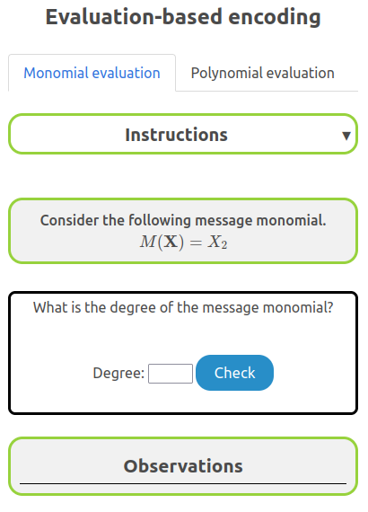
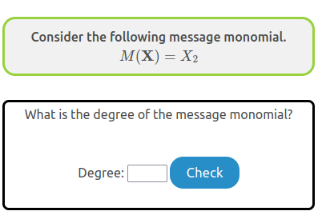
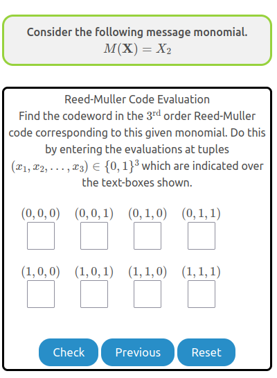
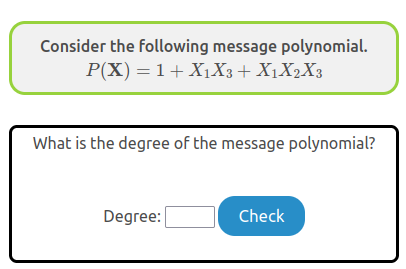
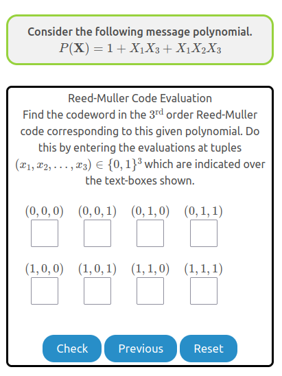

### Procedure

The experiment consists of two tasks. The user is recommended to go through these in the same sequence as they are presented. 

1. Monomial evaluation
    * Given a Monomial, identify its degree and evaluate it on different points.
2. Polynomial evaluation
    * Given a Polynomial, identify its degree and evaluate it on different points.

## Overview of the Experiment window

    

The experiment window consists of the following components:
1. **Task tab**: The task tab contains the list of tasks that need to be performed in the experiment. The user can navigate to any task by clicking on the corresponding task in the task tab.
2. **Instruction box**: The instruction box displays step-by-step instructions to perform the task.
3. **Question box**: The question box displays the question to be answered by the user.
4. **Observation box**: The observation box displays the feedback messages based on the user's input.
5. **Action box**: The action box contains the input elements and buttons to perform the task.

## Experiment: 

There are two tasks in this experiment.

### Task 1: Monomial Evaluation

1. **Identify Degree**: Given a monomial, find its degree

    

2. **Evaluate the codeword corresponding to the monomial**: Given a monomial, find its evaluation at tuples given below

    

### Task 2: Polynomial Evaluation

1. **Identify Degree**: Given a polynomial, find its degree

    

2. **Evaluate the codeword corresponding to the polynomial**: Given a polynomial, find its evaluation at tuples given below

    

